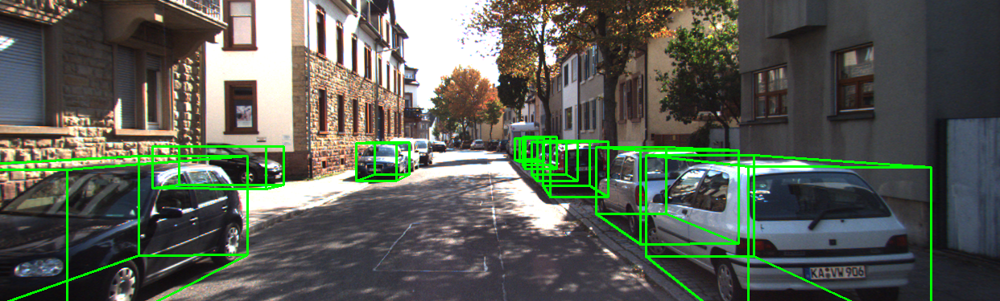
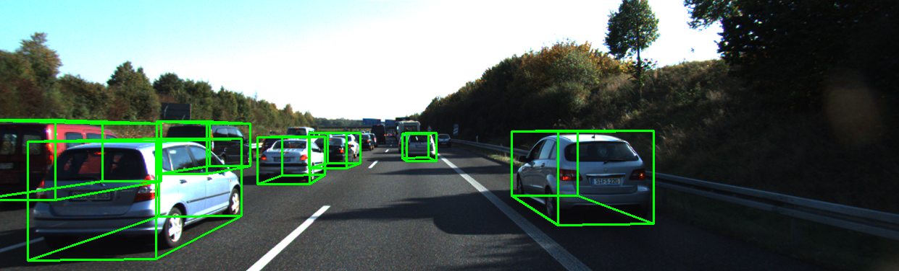
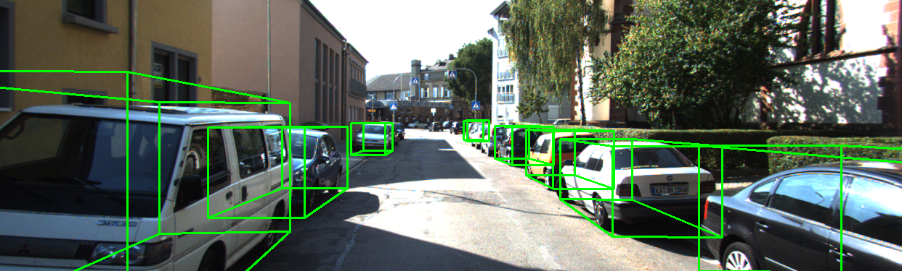

# Pseudo-LiDAR End to End

## Introduction

In this work, I implemented the Pseudo-LiDAR End to End which can directly generate accurate 3D bounding box **from binocular camera images in a end-to-end method**. This implementation solution includes three parts: stereo matching, depth map to Pseudo-LiDAR, and point cloud-based 3D object detection algorithm. First, I chose [GA-Net](https://arxiv.org/abs/1904.06587) as the stereo matching algorithm for this project because GA-Net is the top-ranked algorithm on the KITTI leaderboard and its aggregation strategy is more conducive to generating more detailed depth map. Second, according to the idea introduced in this paper on [Pseudo-LiDAR](https://arxiv.org/abs/1812.07179), the depth map can be transformed into a pseudo-point-cloud representation through the camera's intrinsics parameter matrix. Finally, the point cloud-based [PointRCNN](https://arxiv.org/abs/1812.04244) detection algorithm is used as a 3D object detector. PointRCNN can also be used to detect Pseudo-LiDAR data, because of foreground points classification strategy, refinement in the canonical coordinate by the proposed bin-based 3D box regression loss, and the set abstraction of its backbone network PointNet++.

### Results







### Supported features and ToDo list

- [x] PyTorch 1.2
- [x] KITTI Dataset support
- [x] TensorboardX
- [x] Multiple GPUs support
- [x] Inference end to end
- [x] Some bugs of inference and training will be fixed in some days
- [x] Training end to end
- [x] Get disp map by GANet
- [ ] Some code need to update

## Installation

### Requirements

All the codes are tested in the following environment:

- Linux (tested on Ubuntu 16.04)
- Python 3.6+
- PyTorch 1.2
- CUDA 10.0

### Install Pseudo-LiDAR End to End

a. Clone the Pseudo-LiDAR End to End repository.

```
git clone https://github.com/ustc-keyanjie/Pseudo-LiDAR-End-to-End.git
```

b. Install the dependent python libraries like `easydict`,`tqdm`, `tensorboardX `etc.

c. Build and install the`GANet`, `sync_bn`, `pointnet2_lib`,  `iou3d`,  `roipool3d` libraries by executing the following command:

```
cd Pseudo-LiDAR-End-to-End/scripts
bash compile.sh
```

## Dataset preparation

Please download the official [KITTI 3D object detection](http://www.cvlibs.net/datasets/kitti/eval_object.php?obj_benchmark=3d) dataset and organize the downloaded files as follows:

```
Pseudo-LiDAR-End-to-End 
├── data
│   ├── KITTI
│   │   ├── ImageSets
│   │   ├── object
│   │   │   ├──training
│   │   │      ├──calib & label_2 & image_2 & image_3 & disp_map
│   │   │   ├──testing
│   │   │      ├──calib & image_2 & image_3 & disp_map
├── libs
├── tools
├── ...
```

You can organize files manually or run shell script.

a. change `public_dataset_path` in  `scripts/dataset_preparation.sh` to your own kitti dataset path.

b. run `public_dataset_path.sh`

```
bash dataset_preparation.sh
```

## Pretrained model

The pretrained model is trained on the *train* split (3712 samples) and evaluated on the *val* split (3769 samples) and *test* split (7518 samples). The performance on validation set is as follows:

```
Car AP@0.70, 0.70, 0.70:
bbox AP:87.5597, 67.4341, 59.4498
bev  AP:74.2878, 49.7762, 45.5242
3d   AP:61.9844, 42.8151, 36.8504
aos  AP:85.96, 65.13, 57.18
Car AP@0.70, 0.50, 0.50:
bbox AP:87.5597, 67.4341, 59.4498
bev  AP:87.8729, 67.3340, 59.2771
3d   AP:87.5415, 65.8819, 58.2879
aos  AP:85.96, 65.13, 57.18
```

a. Download the pretrained model.

You could download the pretrained model(Car) of Pseudo-LiDAR End to End from [Google Drive](https://drive.google.com/file/d/1FZN-0mZEwBSIEOqG1unCKA2-3Vw3ZVCo/view?usp=sharing) or [BaiduYun](https://pan.baidu.com/s/1tq1cCYYSqYQoVy9DqG4G3w
)(Password: op8m).

b. Move it to checkpoints folder.

```
cd ..
mkdir checkpoints/
mv pl_e2e.pth checkpoints/
```

## Inference

a. Enter `tools` directory

```
cd tools/
```

b. Inference by GPU

```
python eval.py --cfg_file cfgs/default.yaml --ckpt pl_e2e.pth --batch_size 1 --worker 16
```

The code also support multi GPU, add `–mgpus`.

```
python eval.py --cfg_file cfgs/default.yaml --ckpt pl_e2e.pth --batch_size 4 --worker 16 --mgpus
```

## Training

a. Prepare disp map

```
python get_disp_map_by_velo.py
```

b. train end to end

```
python train.py --ckpt pl_e2e.pth --batch_size 4 --worker 16 --train_mode all --mgpus
```

## Get disp map by GANet

a. Enter `checkpoint/GANet` directory

```
cd ../checkpoint
mkdir GANet
cd GANet
```

b. Download GANet pretrained model from [Google Drive](https://drive.google.com/open?id=19hVQXpcXwp7SrHgJ5Tlu7_iCYNi4Oj9u). You can also get the link from the [repo of GANet](https://github.com/feihuzhang/GANet).

c. Run the code.

```
cd ../../tools
python get_disp_map_by_GANet.py --cfg_file cfgs/default.yaml --ganet_ckpt GANet.pth  --batch_size 4 --workers 16 --output_dir ../data/KITTI/object/training/disp_map/ --mgpus
```

***Note***: The result of this code may override the output in disp_map directory, so you need to save the files in disp_map directory first or change the `output_dir` path.

## Reference

- [GA-Net](https://github.com/feihuzhang/GANet)
- [Pseudo-LiDAR](https://github.com/mileyan/pseudo_lidar)
- [PointRCNN](https://github.com/sshaoshuai/PointRCNN)

